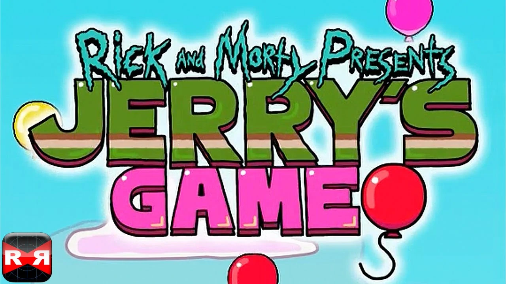

<p align="center"></p>

## About

Rick And Morty: Jerry's Game is the balloon-popping game that Jerry gets addicted to during one of the episodes of the hilarious animated series Rick and Morty. The game is just as you see it in the episode: a crude simulator where you pop the balloons that appear on the screen.

- [Watch Episode Scene Here](https://www.youtube.com/watch?v=yR1aZZOT3wI)

Gameplay in Rick And Morty: Jerry's Game is so repetitive to the point of absurdity. This game is simply a parody of the genre, so its gameplay is identical to the games it's making fun of.

Rick And Morty: Jerry's Game is a strange game, because although it's not fun in and of itself, it should be a lot of fun for any fan of Rick and Morty, especially whenever the pair shows up to congratulate you.


## Description

When you start playing Rick And Morty: Jerry's Game, you have absolutely nothing: no music, no variety of balloons, no changes in scenery, no way to leave the game halfway, nothing.

<p>
    
</p>

From Adult Swim's Rick and Morty comes Jerry's Game, the pinnacle of mobile gaming! Step into the shoes of Morty's Dad, Jerry Smith, and invest your free time in our balloon-popping simulator for accomplished, respected individuals. Need encouragement for performing infant-level motor functions? Do you wish bubble wrap came with achievements? Jerry's Game has all of this and more! Get in there and get poppin'!

- Pop the balloons!
- Keep popping the balloons!
- Never stop popping the balloons
- Unlock new skins and features
- Infinite Replayability

## Tech Stacks

This small app is simply built with [React Native](https://reactnative.dev/). No game engine was needed, simply small uses of animations and event handlers was sufficient.

Animations were handle with React Native's built-in [Animated Library](https://reactnative.dev/docs/animated)

## How To Play

### Prerequisites
* Download and install [Node.js](https://nodejs.org/en/)

* npm
  ```sh
  npm install npm@latest -g
  ```
* Expo CLI
  ```sh
  npm install --global expo-cli
  ```
* Expo Go mobile app

### Installation

1. Clone the repo
   ```sh
   git clone https://github.com/Joe-Moussally/Jerrys-Boring-Game.git
2. Install dependencies
   ```sh
   npm install
   ```
3. Run the start up command
   ```sh
   npm start
   ```
4. Scan the generated QR code with your camera (ios) or through the Expo Go application (android).